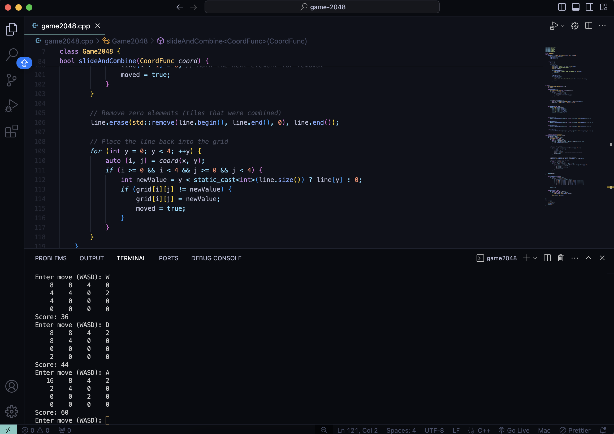

# 2048 basic gameplay

During my 3-hour Advanced C++ exam at UNSW, one of the two questions was to write the 2048 game from scratch. Although I recieved a high and respectable grade in the end, I felt quite frustrated that I couldn't finish the whole thing (Q1 took me 2.5 hours!). So I decided to finish this once I got home.

## Screenshot

## Though process.

It's a real basic implementation. Just a very simple class and one template function. The gameplay is via basic WASD. I can't remember how the exam file was supposed to look but I reckon this should've been enough! It only I had just 10 more minutes I'm sure I could've fin it!
